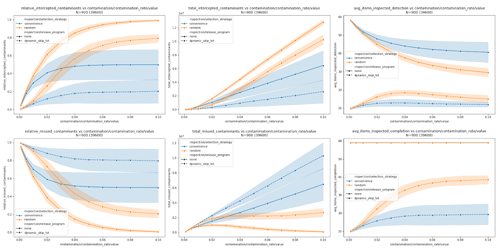
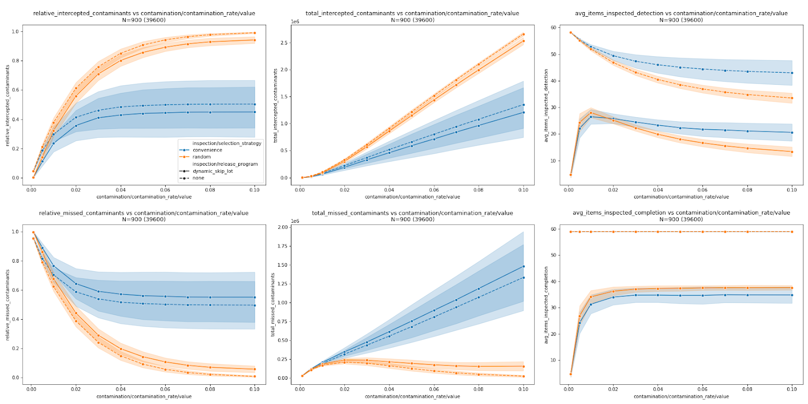
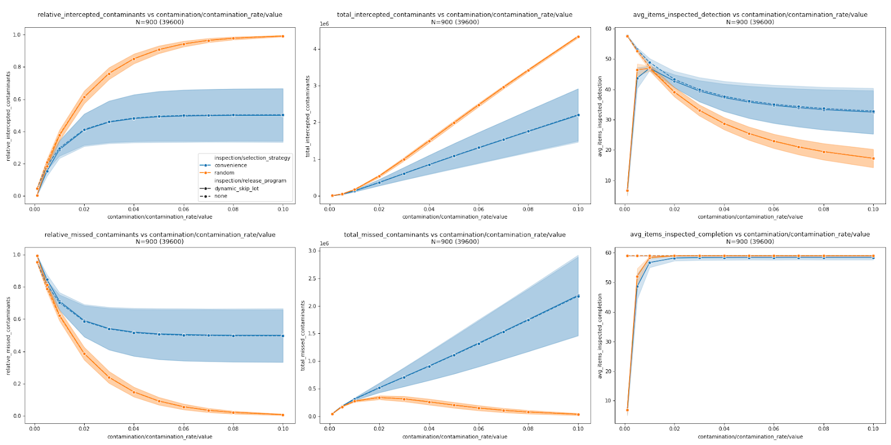
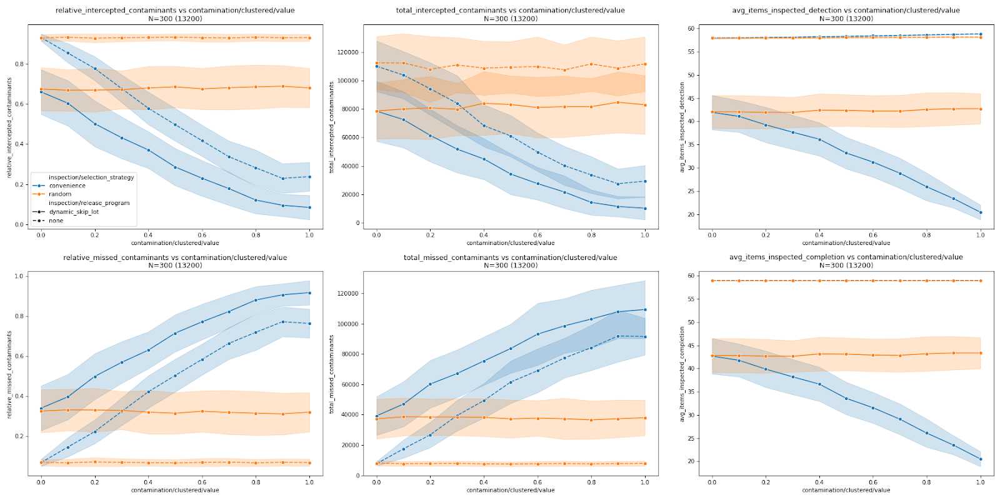
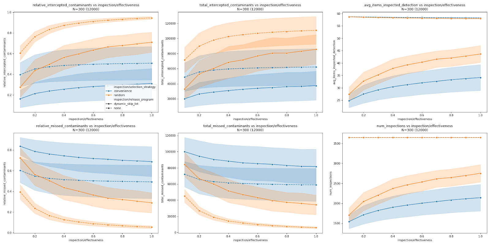

# Experiments, Uncertainty, and Sensitivity

PoPS Border is a stochastic simulator that generates synthetic shipment data and applies inspection processes to the shipment data. The outputs of such simulations are inherently uncertain due to uncertainty in input parameters, the stochasticity of the simulation process, and choices in the scenarios explored.

A single PoPS Border run produces a single outcome. Because the simulator is stochastic, each run is subject to probabilistic variation—for example, an inspection might have a 10% probability of missing a contaminated item. In this example, the simulated process misses a contaminated item approximately 1 in 10 simulation runs while detecting it in the remaining 9 runs. Pseudo-random number generators drive this stochasticity; reproducibility of results is ensured by fixing the random seed. Additional runs with the same or different seeds are used to account for input-parameter uncertainty and to explore scenarios.

## Multiple Runs

Rather than relying on a single run, analyses typically involve a collection of runs, i.e., a simulation experiment (or, more generally, a computational experiment). Such an experiment may include several types of runs:

* Stochastic realizations (replicates for process uncertainty): Runs with the same parameter values but different seeds, producing independent realizations of random events.
* Parameter-uncertainty runs: Runs generated by varying uncertain parameters or inputs (e.g., effectiveness values of 0.5 vs. 0.6, or contamination rates drawn from a beta distribution). These may be analyzed separately as distinct scenarios or pooled with replicates.
* Parameter sweeps (sensitivity scenarios): Runs that vary one parameter across a predefined range to study its influence on outcomes.
* Evaluation scenarios: Runs designed to represent the conditions and choices we want to evaluate, such as alternative inspection strategies, targeting methods, or different contamination situations (e.g., higher infestation rates, clustering, or commodity-specific risks).

For each scenario, multiple stochastic realizations (replicates) are used to capture random variation in contamination placement and detection. These are often complemented by parameter-uncertainty runs, which vary uncertain parameters such as inspection effectiveness or contamination rates. Replicates and parameter-uncertainty runs together provide a distribution of possible outcomes for a given set of conditions.

When parameter sweeps (sensitivity scenarios) are included, one parameter is systematically varied across a predefined range while other parameters remain fixed. This links each evaluation scenario not to a single aggregate outcome but to a series of outcomes spanning the sweep values. The purpose is to characterize how results respond to changes in key parameters while still incorporating stochastic realizations and parameter uncertainty within each sweep.

Evaluation scenarios represent the higher-level conditions and choices of interest, such as comparing inspection strategies, targeting methods, or contamination situations. These scenarios define the context in which replicates, uncertainty runs, and parameter sweeps are conducted, and ultimately frame the policy-relevant insights that the simulation provides.

## Example Result

Outcomes of a simulation experiment can be visualized by plotting the central tendency (e.g., mean across replicates and uncertainty runs) for each sweep value as a line, with shaded bands representing the spread of outcomes (e.g., standard deviation). This approach aims to communicate both the influence of parameter variation and the stochastic uncertainty inherent in the simulation, while evaluating different scenarios.

The following figure shows six dependent variables (y-axis) for four evaluation scenarios: two selection strategies and an active or inactive skip lot release program (lines). Each dot represents the mean value of the dependent variable for a given sweep parameter value (x-axis), in this case, increasing contamination rate. This mean value is computed from 900 different runs, which include stochastic realizations and parameter-uncertainty runs (represented by one dot in the figure). A parameter sweep is performed across contamination rates for 11 values; one line is based on 9900 runs, and the figure with four evaluation scenarios is based on 39600 runs.

## Creating a Simulation Experiment

First, we identify the different scenarios that we want to explore. For example, we might consider different ways inspections are performed, such as a scenario with no release program versus one with a dynamic skip lot program. Typically, there is more than one scenario, although we may be interested in only one. As part of creating the scenarios, we select specific values and the overall configuration. These scenarios fall under the type of runs called evaluation scenarios. While we could run the simulation once for each scenario in theory, in practice, we add additional parameters, which multiply the number of runs in an actual simulation experiment.

A simulation experiment is constructed by combining scenarios with systematic variations in parameters, such as inspection effectiveness or contamination rate, to assess their influence on outcomes. These parameter values can be varied by drawing from a distribution for each run, taking uniformly spaced values within an interval (similar to a uniform distribution), or using two minimum and maximum values (a simplified case of the former). By varying the parameter values, the results capture the uncertainty in the input parameters. This distinguishes between variation driven by uncertainty in the underlying parameters and variation driven by differences between scenarios.

Additionally, several stochastic runs with different seeds are needed for each selected parameter combination to generate independent realizations (replicates) that reflect uncertainty in the simulation process. More runs improve both the convergence of results and the ability of different runs to capture the spectrum of possible stochastic outcomes.

Since each simulation inspects a specific number of consignments, the number of consignments also influences the convergence of the results. For time-dependent processes, such as dynamic skip lot, the number of consignments does not affect the number of replicates. However, when all simulated processes are time-independent, the number of consignments determines the number of replicates, since the same process is repeated multiple times across different consignments within the same simulation.

In addition to runs for parameter and process uncertainty, each scenario may include multiple parameter combinations forming a sweep. This allows for sensitivity analysis and further exploration of parameter uncertainty. Unlike parameter uncertainty, where values are chosen from a specific distribution, a parameter sweep for sensitivity analysis can use values that span a range of possible outcomes while keeping computational cost low by avoiding runs with values that behave linearly.

## Example Experiment

First, we examine sensitivity to changes in contamination rate by sweeping through contamination rate values. We use the fixed-value setting for contamination rate testing, selecting values between 0.001 and 0.1. We assume inspection effectiveness to be between 0.7 and 0.9 (using 0.7, 0.8, and 0.9 for parameter-uncertainty runs) and contamination clustering value between 0.3 and 0.7 (using 0.3, 0.5, and 0.7 for parameter-uncertainty runs). We examine sensitivity across four scenarios: using or not using the dynamic skip lot release program, and using random or convenience sample selection strategies during the inspection itself. Each simulation generates 10 consignments per day for 365 simulated days (a year starting in January). We compute two variants: one in which two out of three simulated commodities are contaminated only from May through September, and one in which all consignments are contaminated at the given contamination rate. The skip lot release program uses 10 compliance levels, with each level halving the sampling fraction when a clearance number of 10 is achieved. In the release program, a detected contaminated consignment moves the corresponding tracked group (aka MID) one compliance level down to a more stringent sampling fraction. The lost level is reinstated if 5 consecutive checked consignments are without detected contaminants. 

Contaminant present for ⅔ of consignments only for 6 months of the year:

From the plots of relative and absolute contaminants intercepted and missed (first and second columns), we can observe that employing the dynamic skip lot program gives similar results to always checking every consignment. The difference is negligible compared to the difference between convenience and random sampling of items within each consignment. On the other hand, the amount of work counted as the number of items inspected (third column) is always lower for the dynamic skip lot compared to not using any release program. The difference in the amount of work between convenience and random sampling is not reflected in the plots (random sampling involves selecting items at random from the whole consignment). Nevertheless, random sampling results in fewer items being inspected if sampling stops at the first contaminant detection (top right), except at low contamination rates, where it is more likely to detect contamination than convenience sampling, leading to more inspections and thus more items inspected. Sampling items in consignment to completion of the whole sample (bottom right) necessarily results in the same number of items being inspected between convenience and random sampling without any release program. With the skip lot release program, random sampling again leads to more detections, resulting in more inspections, which in turn increase the number of items inspected.

Contaminant is always present for all consignments:

If contaminants are always present, the skip lot release program does not yield any difference in contaminants missed or intercepted (first and second columns), except for small contamination rates (\<2%). However, the release program affects the number of items inspected, especially at low contamination rates.

Now, we use a beta distribution for the contamination rate with parameters α \= 0.009 and β \= 3.3062, according to Montgomery et al. (2023). We are sweeping through effectiveness and clustering values. For this part of the experiment, we use a more stringent skip lot release program with only 3 levels (sampling fractions 1, 0.5, and 0.25), no quick reinstating, monitoring level same as the start level, and clearance number 50\. All are in 3 groups (MIDs), but are all contaminated in the same way throughout the whole simulation. Since there is no time-dependent variation in the contamination, the release program reacts only to the beta-distribution-driven stochastic variation in the contamination. All other parameters are the same as the above part of the experiment, with sweeps over the contamination rate.

We run simulations with effectiveness values between 10% to 100% influencing the effectiveness of each item check (for example, 50% effectiveness results in only every second contaminated item being detected), resulting in the following plots:

In the plot, we observe that with effectiveness even as low as 30% (0.3), a skip lot release program combined with random sampling of items can intercept more contaminants than convenience sampling of items without a release program (top left), while requiring less work than not using a release program (third column). The number of inspected items to the first containment detection (top right) and the number of inspections (bottom right) have the same behavior as the number of items inspected when inspecting all items (not shown). Neither the number of inspected items nor the number of inspections captures the difference in the amount of work between convenience and random sampling. However, the plots show an additional difference in the amount of work, caused by a higher number of contaminants incorrectly classified as not contaminated during convenience sampling, resulting in less work but more missed contaminants (bottom row).

Last, we sweep through the clustering value, which determines how clustered or evenly distributed contaminated items are in a consignment. We use values between 0 (contaminated items uniformly distributed throughout the consignment) and 1 (contaminated items completely clustered in a single part of the consignment).

When using random sampling within a consignment, the change in clustering does not affect the results (all random-sampling strategy lines are flat, with only stochastic variation). On the other hand, for the convenience sampling strategy, we observe a significant drop in intercepted contaminants (top left) and a corresponding increase in missed contaminants (bottom left).

